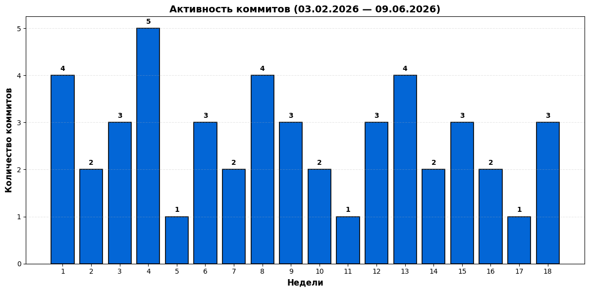
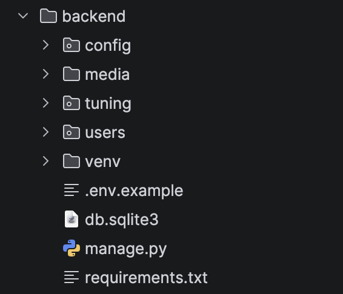
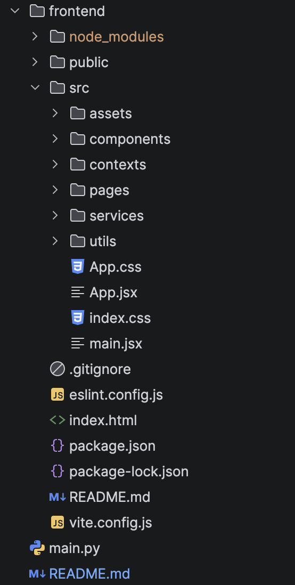

# 🏎️ DR.car - Веб-приложение для студии тюнинга автомобилей

## ✅ Описание
Автоматизируйте работу студии тюнинга.
Клиенты записываются онлайн, покупают товары из каталога и в личном кабинете видят, на каком этапе работы находится их автомобиль.
Мастера управляют заказами, статусами машин и наполнением каталога — всё в одном веб‑приложении.

## 📊 Статистика разработки

- **Период разработки:** 18 недель (03.02.2026 — 09.06.2026)
- **Всего коммитов:** 
- График активности:

## 👨🏻‍💻Технологический стек

### Backend

- **Django** - веб-фреймворк
- **JWT** - аутентификация (access + refresh токены)
- Полноценное REST API с CRUD-операциями
- Хранение токенов в localStorage, автоматическое обновление

## Frontend
- **React** — библиотека для построения интерфейсов
- **Vite** — сборщик

## 💡Основной функционал

### Публичная часть (доступна всем)

- Просмотр информации о студии
- Просмотр каталога товаров/услуг
- Поиск товаров/услуг 
- Возможность зарегистрироваться 

### Приватная часть (для авторизованных пользователей)

- Покупка товаров 
- Просмотр корзины
- Возможность записаться на любую услугу онлайн 
- Просмотр статуса работы над машиной(Готов к выдаче/Ожидает запчасти и тд.)
- Возможность писать коментарии к услугам

### Административная часть (для администраторов сайта)

- Управление категориями/товарами/услугами/статусами машин
- Возможность наполнять каталог
- Добавление новых проектов студии
- Доступ к просмотру информации о пользователях, записях на услуги и заказах

## ⚙️ Структура проекта

### 👾 Backend 

### ✔️ Frontend

### 📁 Документация

## 👨🏻‍🎓 Автор 
[Перейти на GitHub](https://github.com/Ibrashka07)

Студент гуппы ПИЖ-б-0-24-1\
Карданов Ибрагим Артурович\
Направление подготовки: 09.03.04 «Программная инженерия»\
Профиль: «Разработка и сопровождение программного обеспечения»

## 📚 Примечание 

Проект создан в учебных целях в рамках Курсовой работы по дисциплине: "Технология разработки программного
обеспечения"